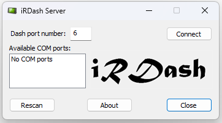

# iRDash-Server
Connects to a running iRacing simulation and sends its telemetry data via USB to an Arduino board.
Currently only the car's telemetry data is sent, the slow moving data (lap times, other cars, etc.) is not.

Ardunio projects to display the transmitted data on a TFT display:
## iRDash Client v1
- https://github.com/UmmonPwr/iRDash_Client
- MCU: ATMEGA2560
- Display resolution: 320x240
- Graphics library: UTFT

## iRDash Client v2
- https://github.com/UmmonPwr/iRDash_Client_v2
- MCU: ESP32
- Display resolution: 320x240
- Graphics library: Arduino_GFX

## iRDash Client v3
- https://github.com/UmmonPwr/iRDash_Client_v3
- MCU: ESP32S3
- Display resolution: 800x480
- Graphics library: LVGL

To compile the solution you need to download the iRacing SDK from iRacing's forum and place it in the "irsdk" folder next to the folder where you downloaded "iRDash server".

## Usage
- Enter manually the COM port number at "Dash port number" and click connect
- If app was able to open the COM port then button changes from "Connect" to "Disconnect"
- COM port number is stored at app closing and set when the app is launched
- Available COM ports window is showing the actually available COM ports, list is updated when "Rescan" is clicked

## Screenshot:
